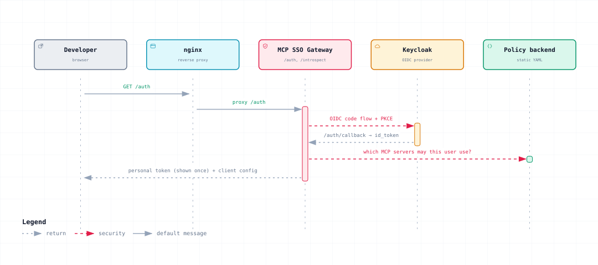
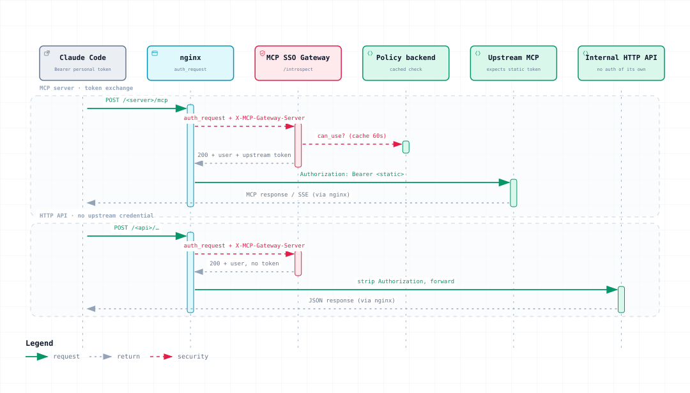
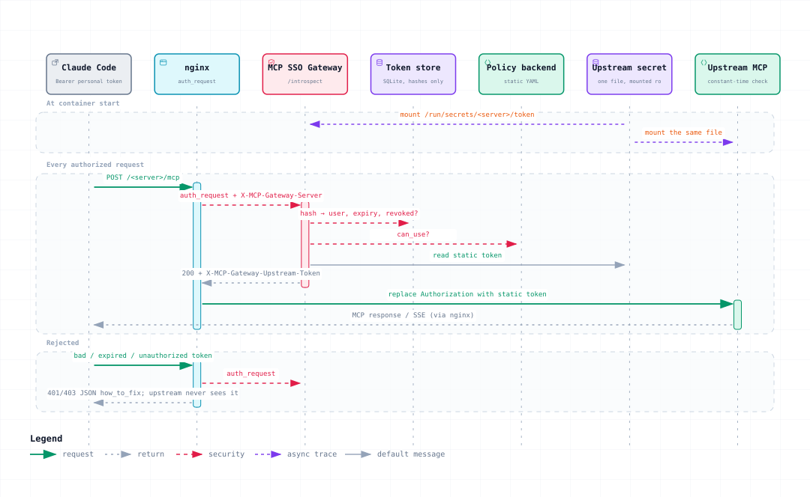

# MCP SSO Gateway

MCP SSO Gateway is a self-hosted OIDC login and personal-token gateway for MCP
servers and internal HTTP APIs. nginx is the only public ingress: it authorizes
protected requests through a private gateway introspection subrequest and never
exposes that endpoint publicly.

## v0.1 capabilities

- OIDC authorization-code login with PKCE; Keycloak is the demo identity provider.
- Revocable, hashed personal access tokens (PATs), issued once through the UI or
  administratively with `mcp-gateway issue`.
- Static YAML registry and policy only. Changes take effect after a gateway restart.
- MCP routes exchange a personal token for a service-specific upstream token.
  HTTP API routes strip `Authorization` and forward only the gateway identity header.
- SQLite state requires exactly one gateway worker.

Keycloak roles/groups, OpenFGA, policy caching, and MCP OAuth authorization-server
discovery are not part of v0.1. The policy's local `roles` are YAML grant labels,
not identity-provider roles.

## Quick start

```sh
uv sync --frozen
scripts/smoke-test.sh
```

The smoke script starts the loopback-only demo, exercises the packaged gateway
and tears down demo volumes. For a manual OIDC check, start the demo with
`docker compose -f demo/compose.yaml up --build -d`, then open
`http://localhost:8080/auth`; sign in as `alice` / `alice-demo-password` and
issue a PAT at `/auth/token`. See the [demo guide](demo/README.md) for teardown.

## How it works

The gateway sits behind nginx. For each protected request, nginx calls the
private introspection endpoint, then either rejects the request or forwards it
to the configured upstream.

### Sign-in and token issuance

<picture>
  <source media="(prefers-color-scheme: dark)" srcset="docs/architecture/sign-in/sign-in-dark.svg">
  
</picture>

The OIDC callback completes the PKCE flow; the PAT is shown once and only its
hash is stored. The session cookie is scoped to `/auth`.

### Protected request

<picture>
  <source media="(prefers-color-scheme: dark)" srcset="docs/architecture/request-flow/request-flow-dark.svg">
  
</picture>

nginx selects the server and strips client-supplied gateway headers. An MCP
route receives its own upstream token; an HTTP API route receives no bearer
token, only the gateway identity header.

### Token exchange and rejection

<picture>
  <source media="(prefers-color-scheme: dark)" srcset="docs/architecture/token-exchange/token-exchange-dark.svg">
  
</picture>

The policy is static YAML loaded at startup; grant changes require a gateway
restart. PAT revocation rejects new requests but does not terminate open streams.
Diagram sources live in [`docs/architecture/`](docs/architecture/).

## Security boundary

- Mount independent secret files only into services that consume them; never put
  secret values in environment variables. Protect the writable SQLite/audit volume.
- nginx clears client-supplied gateway-control headers. Upstreams may trust only
  `X-MCP-Gateway-User` received from nginx on their isolated upstream network;
  direct access to upstreams must remain blocked.
- The demo uses loopback HTTP only and is intentionally insecure. Production MUST
  terminate TLS at nginx before any session cookie or bearer token crosses a network.
- `deploy/docker-compose.example.yml` uses an external HTTPS IdP at
  `idp.example.com`; only the gateway joins its egress network. It publishes
  loopback TLS nginx at `127.0.0.1:8443`, not Keycloak, gateway, or upstream ports.

See [deployment guidance](docs/deploy.md), [client compatibility](docs/client-compatibility.md),
the [demo](demo/README.md), [security policy](SECURITY.md),
[contributing](CONTRIBUTING.md), and the [changelog](CHANGELOG.md).
