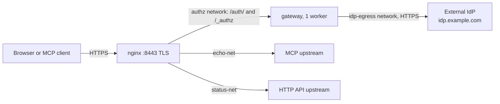
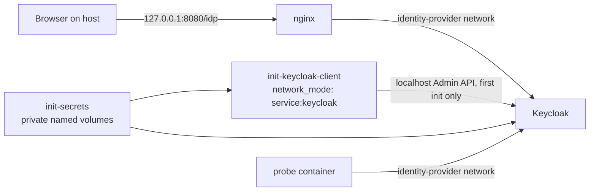

# Deployment

## Production example topology

`deploy/docker-compose.example.yml` is the production-shaped baseline. It uses an
external HTTPS OIDC identity provider (`https://idp.example.com`); it runs no
Keycloak or other identity provider. Register
`https://gateway.example.com/auth/callback` and
`https://gateway.example.com/auth/logged-out` at that provider.

- TLS is mandatory. nginx terminates TLS before a personal bearer token or session
  cookie crosses any network; the example publishes only `127.0.0.1:8443`.
- nginx is the sole ingress and the only allowed introspection caller
  (`MCP_GATEWAY_INTROSPECT_CALLERS=nginx`). Public `/introspect` and `/_authz`
  requests return 404. Gateway and upstreams have no published ports.
- `authz` is internal and joined only by nginx and the gateway. Only the gateway
  joins `idp-egress`. Each upstream has its own internal network shared only with nginx.
- Plain-HTTP or overridden OIDC discovery is rejected unless
  `MCP_GATEWAY_ALLOW_INSECURE_OIDC=true`; keep it `false` in production.
- Secrets are files in service-scoped directories below `/run/secrets`, mounted
  read-only only into consuming services: OIDC client and session secrets into the
  gateway, and each upstream token into the gateway and that upstream. Do not put
  secret values in environment variables.
- Upstreams may trust `X-MCP-Gateway-User` only from nginx on their private
  network. nginx clears client-supplied gateway-control headers. MCP upstreams
  receive a service-specific bearer token; HTTP API upstreams receive no
  `Authorization` header.

The gateway validates static `registry.yaml` and `policy.yaml` once at boot.
Restart or redeploy it to apply policy or registry changes. Its SQLite token
state permits exactly one Uvicorn worker; do not scale the gateway horizontally.

## Demo OIDC fixture

The loopback-only demo uses these fixed endpoints:

| Setting | Value |
| --- | --- |
| Public base URL | `http://localhost:8080` |
| Public issuer | `http://localhost:8080/idp/realms/mcp-demo` |
| Private discovery URL | `http://keycloak:8080/idp/realms/mcp-demo/.well-known/openid-configuration` |
| Callback URL | `http://localhost:8080/auth/callback` |
| Post-logout redirect URL | `http://localhost:8080/auth/logged-out` |

Keycloak's back-channel discovery document reports the public issuer while the
gateway reaches token and JWKS endpoints on the identity-provider network.
The public Keycloak proxy allowlists only browser-required `mcp-demo` OIDC,
login-action, resources, discovery, and JWKS paths; admin, master realm,
metrics, health, and all other paths return 404. The HTTP fixture is demo-only.

### Phase 00 Keycloak-only probe

Run `demo/probe/probe.sh` from the repository root. It uses only the
`keycloak-probe` profile in `demo/keycloak-probe.compose.yaml`; it MUST NOT be
run through `demo/compose.yaml`. The probe starts with `down -v`, exercises a
fresh initialization and a retained-volume recreate, then ends with `down -v`
and confirms that the profile's containers, network, and volumes are gone.

The named network is `mcp-sso-gateway-probe-idp`. Keycloak has no host port;
only nginx publishes `127.0.0.1:8080`. The public proxy allows exactly these
paths for realm `mcp-demo`: authorization, logout, `login-actions/`,
`resources/`, discovery, and JWKS. It returns `404` for Admin and master-realm
paths, metrics, health, the token endpoint, and every unlisted path. nginx
overwrites `Host` and `X-Forwarded-*` from fixed or proxy-derived request data;
it never forwards client-supplied variants.

On a first start, `init-secrets` creates separate project-scoped named volumes
for the bootstrap administrator, OIDC client secret, gateway session secret,
and each upstream token. Keycloak can read only the bootstrap file; the client
initializer can read bootstrap and OIDC client files and writes the persistent
marker. It uses the bootstrap account only through Keycloak localhost, verifies
the complete confidential client representation, then creates a one-shot
least-privilege master-realm service account to delete the bootstrap account,
verify its absence, and remove itself. It deletes the bootstrap password and
atomically creates `/opt/keycloak/data/mcp-gateway-client-initialized`. On
retained-volume recreate, the initializer validates that marker and client-secret ownership and
permissions, skips the Admin API, and exits successfully without a bootstrap
password.

The exact Phase 01 configuration fixture is:

| Setting | Exact value |
| --- | --- |
| Public issuer | `http://localhost:8080/idp/realms/mcp-demo` |
| Private discovery URL | `http://keycloak:8080/idp/realms/mcp-demo/.well-known/openid-configuration` |
| Private token URL | `http://keycloak:8080/idp/realms/mcp-demo/protocol/openid-connect/token` |
| Private JWKS URL | `http://keycloak:8080/idp/realms/mcp-demo/protocol/openid-connect/certs` |
| Private logout URL | `http://keycloak:8080/idp/realms/mcp-demo/protocol/openid-connect/logout` |
| Callback URL | `http://localhost:8080/auth/callback` |
| Post-logout redirect URL | `http://localhost:8080/auth/logged-out` |

Discovery fetched at the private URL MUST report the public issuer above. The
runtime-generated `mcp-gateway` client uses client-secret authentication,
authorization-code flow, exact callback and post-logout URLs, and PKCE S256;
implicit flow, direct-access grants, service accounts, authorization services,
wildcard redirects, and wildcard web origins are disabled. The imported realm
contains no confidential-client secret, bootstrap password, session secret, or
upstream token.
